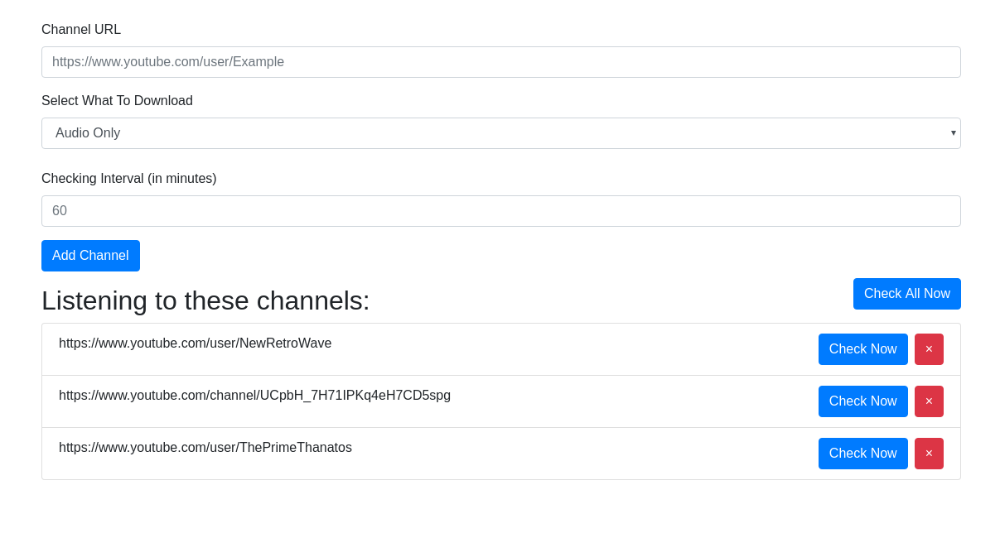

# GoAutoYT
> YouTube Auto downloader

GoAutoYT makes it easy for you to automatically download videos from as many YouTube channels as you'd like.

## Built With
* [Go](https://golang.org/) - Go Language
* [Gorilla Mux](https://github.com/gorilla/mux) - Go Multiplexer
* [Bootstrap](https://getbootstrap.com/) - CSS Framework
* [go-get-youtube](https://github.com/knadh/go-get-youtube) - Go library for downloading YouTube videos